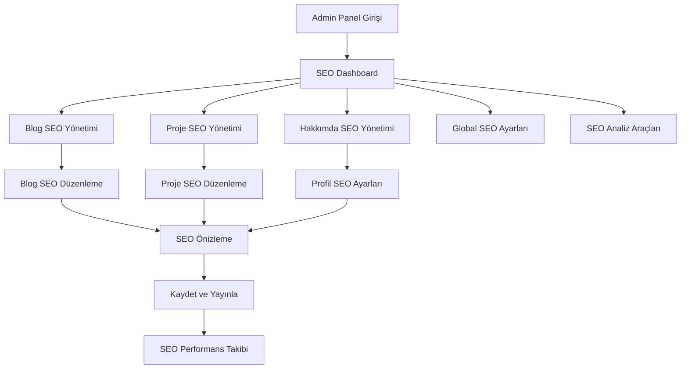

# Portfolio SEO Sistemi - Ürün Gereksinimleri Dokümantasyonu

## 1. Ürün Genel Bakış
Portfolio projesine entegre edilecek kapsamlı SEO yönetim sistemi, blog yazıları, projeler ve hakkımda sayfası için dinamik SEO optimizasyonu sağlayacak. Admin panelinden profesyonelce yönetilebilen bu sistem, arama motoru sıralamasını artırmak ve sosyal medya paylaşımlarını optimize etmek için tasarlanmıştır.

- **Ana Amaç**: Portfolio sitesinin arama motorlarında daha iyi sıralanmasını sağlamak ve sosyal medya görünürlüğünü artırmak
- **Hedef Kullanıcı**: Site yöneticisi (admin paneli üzerinden SEO yönetimi yapacak)
- **Değer Önerisi**: Otomatik SEO optimizasyonu, kolay yönetim ve profesyonel analiz araçları

## 2. Temel Özellikler

### 2.1 Kullanıcı Rolleri
| Rol | Kayıt Yöntemi | Temel Yetkiler |
|-----|---------------|----------------|
| Site Yöneticisi | Mevcut admin girişi | Tüm SEO ayarlarını yönetebilir, analiz raporlarını görüntüleyebilir |

### 2.2 Özellik Modülü
SEO sistemi gereksinimleri aşağıdaki ana sayfalardan oluşmaktadır:

1. **SEO Dashboard**: genel SEO durumu, analiz özeti, hızlı erişim menüsü
2. **Blog SEO Yönetimi**: blog yazıları için SEO başlık, açıklama, anahtar kelime yönetimi
3. **Proje SEO Yönetimi**: proje detayları için SEO optimizasyonu ve meta tag yönetimi
4. **Hakkımda SEO Yönetimi**: hakkımda sayfası için özel SEO ayarları
5. **Global SEO Ayarları**: site geneli SEO konfigürasyonu, robots.txt, sitemap ayarları
6. **SEO Analiz Araçları**: anahtar kelime analizi, meta tag kontrolü, SEO puanlama
7. **Sosyal Medya Optimizasyonu**: Open Graph ve Twitter Card yönetimi

### 2.3 Sayfa Detayları

| Sayfa Adı | Modül Adı | Özellik Açıklaması |
|-----------|-----------|---------------------|
| SEO Dashboard | Genel Durum Paneli | SEO skorları görüntüleme, son aktiviteler, hızlı erişim butonları, genel istatistikler |
| SEO Dashboard | Analiz Özeti | Toplam sayfa sayısı, indekslenme durumu, ortalama SEO skoru, uyarılar |
| Blog SEO Yönetimi | Blog Listesi | Tüm blog yazılarının SEO durumunu listeleme, toplu düzenleme, SEO skoru gösterimi |
| Blog SEO Yönetimi | Blog SEO Düzenleme | SEO başlığı, meta açıklama, anahtar kelimeler, URL slug, canonical URL ayarlama |
| Blog SEO Yönetimi | SEO Önizleme | Google arama sonucu önizlemesi, sosyal medya paylaşım önizlemesi |
| Proje SEO Yönetimi | Proje Listesi | Proje SEO durumları, toplu SEO işlemleri, kategori bazlı SEO yönetimi |
| Proje SEO Yönetimi | Proje SEO Düzenleme | Proje için özel SEO başlık, açıklama, teknik özellikler, portfolio meta tagları |
| Hakkımda SEO Yönetimi | Profil SEO Ayarları | Kişisel marka SEO'su, yetenekler için anahtar kelimeler, deneyim SEO optimizasyonu |
| Global SEO Ayarları | Site Geneli Ayarlar | Site başlığı, açıklama, varsayılan anahtar kelimeler, Google Analytics entegrasyonu |
| Global SEO Ayarları | Teknik SEO | Robots.txt düzenleme, XML sitemap ayarları, canonical URL kuralları |
| SEO Analiz Araçları | Anahtar Kelime Analizi | Kelime yoğunluğu hesaplama, anahtar kelime önerileri, rakip analizi |
| SEO Analiz Araçları | Meta Tag Kontrolü | Başlık uzunluğu kontrolü, açıklama karakter sayacı, eksik tag uyarıları |
| SEO Analiz Araçları | SEO Puanlama | Sayfa bazlı SEO skoru, iyileştirme önerileri, performans takibi |
| Sosyal Medya Optimizasyonu | Open Graph Yönetimi | Facebook, LinkedIn paylaşım optimizasyonu, görsel boyut kontrolü |
| Sosyal Medya Optimizasyonu | Twitter Card Yönetimi | Twitter paylaşım kartları, özet ve büyük görsel seçenekleri |

## 3. Temel Süreç

**Admin SEO Yönetim Akışı:**
1. Admin paneline giriş → SEO Dashboard'a erişim
2. Blog/Proje/Hakkımda modüllerinden birini seçme
3. İlgili içerik için SEO bilgilerini düzenleme
4. SEO önizleme ile kontrol etme
5. Kaydetme ve yayınlama
6. SEO analiz araçları ile performans takibi

**SEO Optimizasyon Süreci:**
1. İçerik oluşturma/düzenleme
2. Otomatik SEO önerilerini alma
3. Anahtar kelime analizi yapma
4. Meta tagları optimize etme
5. Sosyal medya paylaşım ayarlarını yapılandırma
6. SEO skorunu kontrol etme ve iyileştirme

## 4. Kullanıcı Arayüzü Tasarımı

### 4.1 Tasarım Stili
- **Ana Renkler**: Mevcut admin paneli teması ile uyumlu (mavi tonları #007bff, beyaz #ffffff)
- **İkincil Renkler**: Başarı yeşili #28a745, uyarı sarısı #ffc107, hata kırmızısı #dc3545
- **Buton Stili**: Yuvarlatılmış köşeli modern butonlar, hover efektleri
- **Font**: Mevcut admin paneli fontu (genellikle Roboto veya sistem fontu)
- **Layout Stili**: Kart tabanlı tasarım, sol navigasyon menüsü, responsive grid sistem
- **İkon Stili**: Font Awesome ikonları, SEO ile ilgili özel ikonlar (🎯, 📊, 🔍, 📈)

### 4.2 Sayfa Tasarım Genel Bakışı

| Sayfa Adı | Modül Adı | UI Elementleri |
|-----------|-----------|----------------|
| SEO Dashboard | Ana Panel | Renkli istatistik kartları, dairesel progress barlar, hızlı erişim butonları, son aktivite listesi |
| Blog SEO Yönetimi | Blog Listesi | DataTable ile filtrelenebilir liste, SEO skoru progress barları, hızlı düzenleme butonları |
| Blog SEO Düzenleme | Form Alanları | Karakter sayacı ile input alanları, real-time önizleme paneli, anahtar kelime önerisi dropdown |
| SEO Analiz Araçları | Analiz Paneli | Grafik ve chart'lar, renk kodlu uyarı sistemleri, interaktif analiz araçları |
| Global SEO Ayarları | Ayar Formları | Tab'lı arayüz, toggle switch'ler, kod editörü (robots.txt için), drag-drop dosya yükleme |

### 4.3 Responsive Tasarım
- **Desktop-first** yaklaşım, admin paneli genellikle masaüstünden kullanılır
- **Tablet uyumluluğu** için orta ekran boyutlarında optimizasyon
- **Mobil erişim** için temel işlevsellik, touch-friendly butonlar
- **Minimum genişlik**: 320px mobil cihazlar için