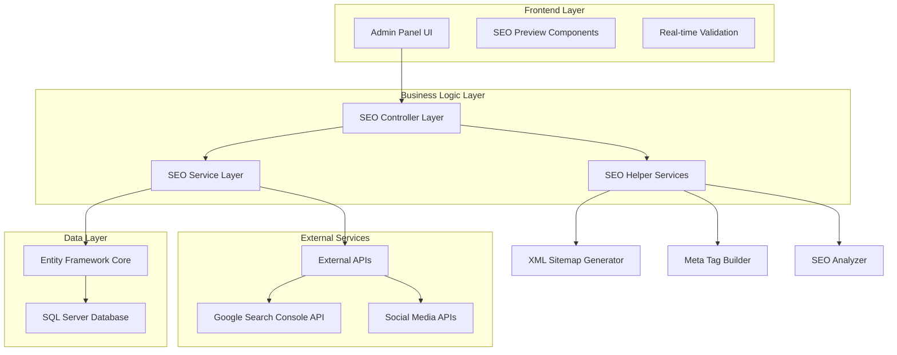
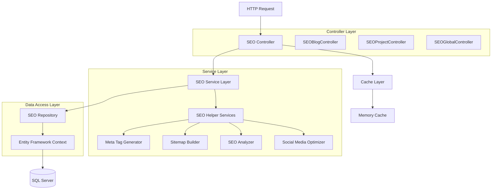
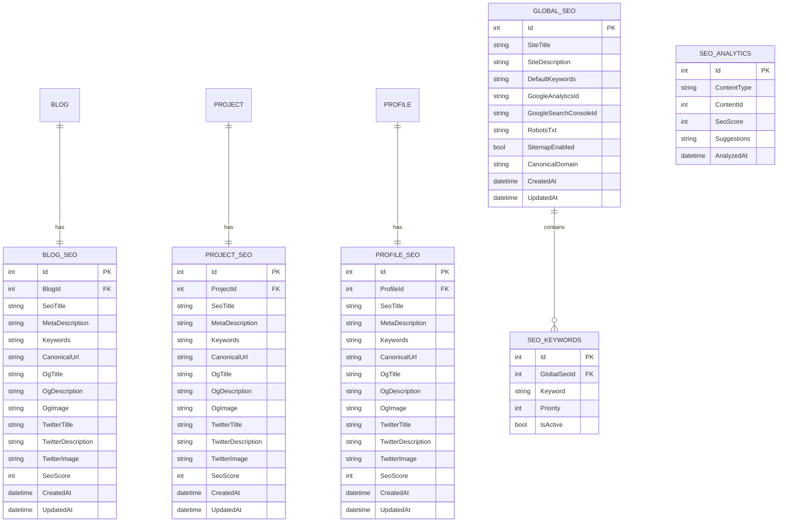

# Portfolio SEO Sistemi - Teknik Mimari Dokümantasyonu

## 1. Mimari Tasarım



## 2. Teknoloji Açıklaması

* **Frontend**: ASP.NET Core MVC Razor Views + Bootstrap 5 + jQuery + Chart.js (SEO analiz grafikleri için)

* **Backend**: ASP.NET Core 6.0 + Entity Framework Core 6.0.36

* **Database**: SQL Server (mevcut Supabase yerine)

* **Cache**: IMemoryCache (performans için)

* **External APIs**: Google Search Console API, Open Graph Debugger API

## 3. Route Tanımları

| Route                        | Amaç                        |
| ---------------------------- | --------------------------- |
| /Admin/SEO/Dashboard         | SEO ana dashboard sayfası   |
| /Admin/SEO/Blog              | Blog SEO yönetim listesi    |
| /Admin/SEO/Blog/Edit/{id}    | Blog SEO düzenleme sayfası  |
| /Admin/SEO/Project           | Proje SEO yönetim listesi   |
| /Admin/SEO/Project/Edit/{id} | Proje SEO düzenleme sayfası |
| /Admin/SEO/Profile           | Hakkımda SEO yönetimi       |
| /Admin/SEO/Global            | Global SEO ayarları         |
| /Admin/SEO/Analytics         | SEO analiz araçları         |
| /Admin/SEO/SocialMedia       | Sosyal medya SEO ayarları   |
| /sitemap.xml                 | Otomatik XML sitemap        |
| /robots.txt                  | Dinamik robots.txt          |

## 4. API Tanımları

### 4.1 SEO Yönetim API'leri

**Blog SEO Güncelleme**

```
POST /api/seo/blog/{id}
```

Request:

| Parametre Adı   | Parametre Tipi | Zorunlu | Açıklama                              |
| --------------- | -------------- | ------- | ------------------------------------- |
| seoTitle        | string         | true    | SEO başlığı (max 60 karakter)         |
| metaDescription | string         | true    | Meta açıklama (max 160 karakter)      |
| keywords        | string         | false   | Anahtar kelimeler (virgülle ayrılmış) |
| canonicalUrl    | string         | false   | Canonical URL                         |
| ogTitle         | string         | false   | Open Graph başlığı                    |
| ogDescription   | string         | false   | Open Graph açıklaması                 |
| ogImage         | string         | false   | Open Graph görseli                    |

Response:

| Parametre Adı | Parametre Tipi | Açıklama          |
| ------------- | -------------- | ----------------- |
| success       | boolean        | İşlem durumu      |
| seoScore      | int            | SEO skoru (0-100) |
| warnings      | array          | Uyarı mesajları   |

**SEO Analiz API**

```
GET /api/seo/analyze/{contentType}/{id}
```

Request:

| Parametre Adı | Parametre Tipi | Zorunlu | Açıklama                             |
| ------------- | -------------- | ------- | ------------------------------------ |
| contentType   | string         | true    | İçerik tipi (blog, project, profile) |
| id            | int            | true    | İçerik ID'si                         |

Response:

```json
{
  "seoScore": 85,
  "titleLength": 45,
  "descriptionLength": 145,
  "keywordDensity": {
    "web tasarım": 2.5,
    "portfolio": 1.8
  },
  "suggestions": [
    "Meta açıklamayı 160 karaktere tamamlayın",
    "H1 etiketi eksik"
  ],
  "socialMediaPreview": {
    "facebook": "...",
    "twitter": "..."
  }
}
```

**XML Sitemap Oluşturma**

```
GET /api/seo/sitemap/generate
```

Response:

| Parametre Adı | Parametre Tipi | Açıklama                     |
| ------------- | -------------- | ---------------------------- |
| success       | boolean        | Oluşturma durumu             |
| urlCount      | int            | Sitemap'e eklenen URL sayısı |
| lastModified  | datetime       | Son güncelleme tarihi        |

## 5. Sunucu Mimarisi



## 6. Veri Modeli

### 6.1 Veri Modeli Tanımı



### 6.2 Veri Tanımlama Dili (DDL)

**Blog SEO Tablosu**

```sql
-- Blog SEO tablosu oluşturma
CREATE TABLE BlogSeo (
    Id INT IDENTITY(1,1) PRIMARY KEY,
    BlogId INT NOT NULL,
    SeoTitle NVARCHAR(60) NULL,
    MetaDescription NVARCHAR(160) NULL,
    Keywords NVARCHAR(500) NULL,
    CanonicalUrl NVARCHAR(500) NULL,
    OgTitle NVARCHAR(60) NULL,
    OgDescription NVARCHAR(160) NULL,
    OgImage NVARCHAR(500) NULL,
    TwitterTitle NVARCHAR(60) NULL,
    TwitterDescription NVARCHAR(160) NULL,
    TwitterImage NVARCHAR(500) NULL,
    SeoScore INT DEFAULT 0,
    CreatedAt DATETIME2 DEFAULT GETDATE(),
    UpdatedAt DATETIME2 DEFAULT GETDATE(),
    FOREIGN KEY (BlogId) REFERENCES Blog(Id) ON DELETE CASCADE
);

-- Proje SEO tablosu oluşturma
CREATE TABLE ProjectSeo (
    Id INT IDENTITY(1,1) PRIMARY KEY,
    ProjectId INT NOT NULL,
    SeoTitle NVARCHAR(60) NULL,
    MetaDescription NVARCHAR(160) NULL,
    Keywords NVARCHAR(500) NULL,
    CanonicalUrl NVARCHAR(500) NULL,
    OgTitle NVARCHAR(60) NULL,
    OgDescription NVARCHAR(160) NULL,
    OgImage NVARCHAR(500) NULL,
    TwitterTitle NVARCHAR(60) NULL,
    TwitterDescription NVARCHAR(160) NULL,
    TwitterImage NVARCHAR(500) NULL,
    SeoScore INT DEFAULT 0,
    CreatedAt DATETIME2 DEFAULT GETDATE(),
    UpdatedAt DATETIME2 DEFAULT GETDATE(),
    FOREIGN KEY (ProjectId) REFERENCES Proje(Id) ON DELETE CASCADE
);

-- Profil SEO tablosu oluşturma
CREATE TABLE ProfileSeo (
    Id INT IDENTITY(1,1) PRIMARY KEY,
    ProfileId INT NOT NULL,
    SeoTitle NVARCHAR(60) NULL,
    MetaDescription NVARCHAR(160) NULL,
    Keywords NVARCHAR(500) NULL,
    CanonicalUrl NVARCHAR(500) NULL,
    OgTitle NVARCHAR(60) NULL,
    OgDescription NVARCHAR(160) NULL,
    OgImage NVARCHAR(500) NULL,
    TwitterTitle NVARCHAR(60) NULL,
    TwitterDescription NVARCHAR(160) NULL,
    TwitterImage NVARCHAR(500) NULL,
    SeoScore INT DEFAULT 0,
    CreatedAt DATETIME2 DEFAULT GETDATE(),
    UpdatedAt DATETIME2 DEFAULT GETDATE(),
    FOREIGN KEY (ProfileId) REFERENCES Profile(Id) ON DELETE CASCADE
);

-- Global SEO ayarları tablosu
CREATE TABLE GlobalSeo (
    Id INT IDENTITY(1,1) PRIMARY KEY,
    SiteTitle NVARCHAR(60) NOT NULL,
    SiteDescription NVARCHAR(160) NOT NULL,
    DefaultKeywords NVARCHAR(500) NULL,
    GoogleAnalyticsId NVARCHAR(50) NULL,
    GoogleSearchConsoleId NVARCHAR(100) NULL,
    RobotsTxt NTEXT NULL,
    SitemapEnabled BIT DEFAULT 1,
    CanonicalDomain NVARCHAR(100) NULL,
    CreatedAt DATETIME2 DEFAULT GETDATE(),
    UpdatedAt DATETIME2 DEFAULT GETDATE()
);

-- SEO anahtar kelimeler tablosu
CREATE TABLE SeoKeywords (
    Id INT IDENTITY(1,1) PRIMARY KEY,
    GlobalSeoId INT NOT NULL,
    Keyword NVARCHAR(100) NOT NULL,
    Priority INT DEFAULT 1,
    IsActive BIT DEFAULT 1,
    FOREIGN KEY (GlobalSeoId) REFERENCES GlobalSeo(Id) ON DELETE CASCADE
);

-- SEO analiz tablosu
CREATE TABLE SeoAnalytics (
    Id INT IDENTITY(1,1) PRIMARY KEY,
    ContentType NVARCHAR(20) NOT NULL, -- 'blog', 'project', 'profile'
    ContentId INT NOT NULL,
    SeoScore INT DEFAULT 0,
    Suggestions NTEXT NULL,
    AnalyzedAt DATETIME2 DEFAULT GETDATE()
);

-- İndeksler oluşturma
CREATE INDEX IX_BlogSeo_BlogId ON BlogSeo(BlogId);
CREATE INDEX IX_ProjectSeo_ProjectId ON ProjectSeo(ProjectId);
CREATE INDEX IX_ProfileSeo_ProfileId ON ProfileSeo(ProfileId);
CREATE INDEX IX_SeoAnalytics_ContentType_ContentId ON SeoAnalytics(ContentType, ContentId);
CREATE INDEX IX_SeoAnalytics_AnalyzedAt ON SeoAnalytics(AnalyzedAt DESC);

-- Başlangıç verileri
INSERT INTO GlobalSeo (SiteTitle, SiteDescription, DefaultKeywords, SitemapEnabled, CanonicalDomain)
VALUES (
    'Portfolio - Web Developer',
    'Profesyonel web geliştirici portfolyosu. Modern web teknolojileri ile projeler ve blog yazıları.',
    'web developer, portfolio, web tasarım, frontend, backend, full stack',
    1,
    'https://yoursite.com'
);

-- Varsayılan anahtar kelimeler
INSERT INTO SeoKeywords (GlobalSeoId, Keyword, Priority, IsActive)
VALUES 
    (1, 'web developer', 1, 1),
    (1, 'portfolio', 1, 1),
    (1, 'web tasarım', 2, 1),
    (1, 'frontend developer', 2, 1),
    (1, 'backend developer', 2, 1),
    (1, 'full stack developer', 3, 1);
```

